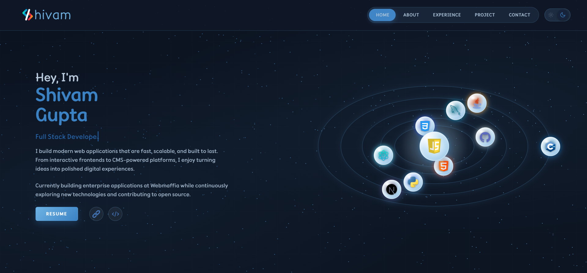

<div align="center">
  
</div>

<br />

<div align="center">

# 🚀 Shivam Gupta — Portfolio

**Personal portfolio built with Next.js, hosted on GitHub Pages.**

[](https://nextjs.org/)
[](https://the-shivam-gupta.github.io/)
[](LICENSE)

</div>

---

## 📖 About

Hi, I'm **Shivam Gupta** — a Full Stack Developer passionate about building fast, scalable, and modern web applications. This is the source code for my personal portfolio site.

🔗 **Live site:** [the-shivam-gupta.github.io](https://the-shivam-gupta.github.io/)

---

## 🛠 Tech Stack

| Technology | Purpose |
|---|---|
| [Next.js 14](https://nextjs.org/) | React framework with App Router |
| [React 18](https://react.dev/) | UI library |
| [Sass](https://sass-lang.com/) | SCSS styling |
| [GitHub Pages](https://pages.github.com/) | Static hosting |
| [GitHub Actions](https://github.com/features/actions) | CI/CD deployment |

---

## 🚦 Running Locally

```bash
git clone https://github.com/the-shivam-gupta/the-shivam-gupta.github.io.git
cd the-shivam-gupta.github.io
npm install
npm run dev
```

Open [http://localhost:3000](http://localhost:3000) in your browser.

---

## 📦 Build for Production

```bash
npm run build
```

Static files are output to the `out/` directory, ready for deployment.

---

## 🌐 Deploy to GitHub Pages

This repo is pre-configured to deploy to GitHub Pages automatically via GitHub Actions. Follow these steps to deploy your own Next.js site:

### 1. Configure Next.js for Static Export

In `next.config.js`, add:

```js
const nextConfig = {
  output: 'export',
  images: { unoptimized: true },
};
```

> `output: 'export'` generates static HTML files in `out/` instead of requiring a Node server.  
> `images.unoptimized` disables the Next.js image optimization API (not supported on static hosts).

### 2. Set Up GitHub Actions

Create `.github/workflows/deploy.yml`:

```yaml
name: Deploy to GitHub Pages

on:
  push:
    branches: [main]

permissions:
  contents: read
  pages: write
  id-token: write

concurrency:
  group: pages
  cancel-in-progress: true

jobs:
  build:
    runs-on: ubuntu-latest
    steps:
      - uses: actions/checkout@v4
      - uses: actions/setup-node@v4
        with:
          node-version: 20
          cache: npm
      - run: npm ci
      - run: npm run build
      - uses: actions/upload-pages-artifact@v3
        with:
          path: ./out

  deploy:
    needs: build
    runs-on: ubuntu-latest
    environment:
      name: github-pages
      url: ${{ steps.deployment.outputs.page_url }}
    steps:
      - id: deployment
        uses: actions/deploy-pages@v4
```

### 3. Enable GitHub Pages in Repository Settings

1. Go to your repo **Settings → Pages**
2. Under **Source**, select **GitHub Actions**
3. Push any commit to `main` to trigger the workflow

The action will build the site and deploy it. You can monitor progress in the **Actions** tab.

### 4. Done 🎉

Your site will be live at `https://<username>.github.io/` (or `https://<username>.github.io/<repo>/` for project sites).

---

## 📁 Project Structure

```
.
├── .github/workflows/deploy.yml   # CI/CD pipeline
├── public/                         # Static assets (images, fonts, PDFs)
├── src/
│   ├── app/                        # Next.js App Router pages
│   │   ├── page.js                 # Home page
│   │   ├── layout.js               # Root layout
│   │   └── resume/page.js          # Resume page
│   ├── components/                 # React components
│   ├── lib/                        # Utility libraries
│   └── scss/                       # SCSS stylesheets
├── next.config.js                  # Next.js configuration
├── package.json
└── README.md
```

<div align="center">
  <p>⭐ If you found this useful, consider giving it a star!</p>
  <p>Built with ❤️ by <a href="https://the-shivam-gupta.github.io/">Shivam Gupta</a></p>
</div>
